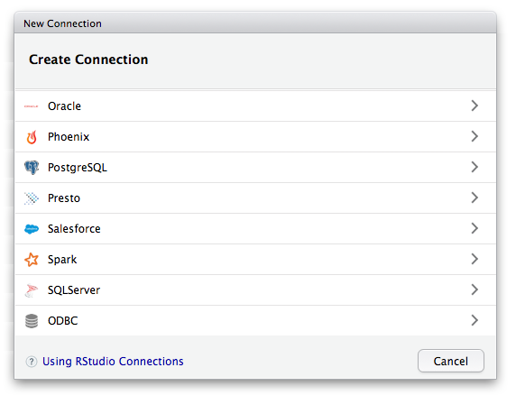

 

#### Connect to a variety of databases from R with production quality ODBC drivers, provided by RStudio

 

#### Filter and aggregate in the database then bring them into R for analysis and visualization

 

#### Create database connections, browsing tables and columns and preview the first 1,000 rows with the latest version of the RStudio IDE

   
